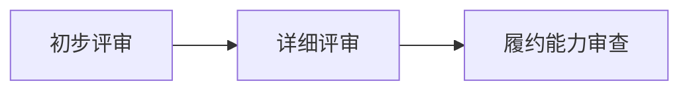

# 招标书

(基于用户输入文本生成 - 项目: 招标项目)

## 第一章 采购公告


以下是根据项目需求撰写的招标书**第一章 采购公告**专业文本，严格遵循《招标投标法》格式规范，覆盖全部核心要素：

---

### **第一章 采购公告**  

---

**武汉市光谷科技金融城建设发展有限公司**（招标人）对**武汉市光谷科创中心一期工程预制构件供货项目**进行公开招标。现邀请符合资格条件的投标人参与投标。

---

#### **一、项目基本信息**  
1. **项目编号**：GKGC-PC-2025-001  
2. **项目名称**：武汉市光谷科创中心一期工程预制构件供货项目  
3. **建设地点**：武汉东湖新技术开发区高新大道888号  
4. **建设规模**：总建筑面积12万平方米（包含：办公楼、综合服务楼、地下车库）  
5. **采购预算**：人民币**1.8亿元**（含三个标段，按工程量结算）  
6. **标段划分**（投标人可选择独立或联合投标）：  
   - **一标段**：办公楼预制构件（梁/板/柱）  
   - **二标段**：综合服务楼预制构件（梁/板/柱）  
   - **三标段**：地下车库预制构件（梁/板/柱）  

---

#### **二、招标内容与技术要求**  
1. **供货范围**：  
   - 钢筋混凝土预制构件（梁、板、柱），具体参数如下：  
     | 构件类型 | 技术指标                     | 执行标准                  |  
     |----------|------------------------------|--------------------------|  
     | 预制梁   | 数量≈1,200根；C50混凝土；长度6–12m | GB/T 14902               |  
     | 预制板   | 数量≈15,000㎡；厚度120mm；平整度≤3mm | GB/T 50081             |  
     | 预制柱   | 数量≈800根；高度3–6m；抗震等级二级 | GB 50011                |  
2. **交付要求**：  
   - 首批货物：合同签订后 **30日历天** 内运抵项目现场  
   - 全部交付：合同签订后 **180日历天** 内完成  
   - 交付方式：根据工程进度 **分批次实时响应供应**  

---

#### **三、投标人资格要求**（★ 未满足任一条件将导致废标）  
1. **法定资质**：  
   - 具备建筑工程施工总承包 **二级及以上资质**（提供有效证书复印件）  
   - 持有有效期内的 **ISO 9001质量管理体系认证证书**  
2. **履约能力**：  
   - 近三年（2022年1月1日至今）承接 **≥2个单体3万平方米以上** 的预制构件供货项目（提供合同及验收证明）  
3. **信用要求**：  
   - 投标截止日前通过“信用中国”（www.creditchina.gov.cn）查询无失信记录（网页截图盖章）  
4. **风险控制能力**：  
   - 具备武汉市及周边 **100公里内自有或合作生产基地**（提供产权证明或合作协议）  
   - 预制柱生产工艺须100%满足二级抗震设计要求（中标后验厂核查）  

---

#### **四、招标文件获取**  
1. **获取时间**：**2025年6月1日9:00至6月7日17:00**（法定节假日除外）  
2. **获取地点**：  
   - 线上：武汉市公共资源交易网（www.whggzy.cn）  
   - 线下：武汉市建设银行大厦4楼招标代理部（武昌区中北路102号）  
3. **文件费用**：**300元/标段**（现金支付，售后不退）  

---

#### **五、投标与开标安排**  
1. **投标截止时间**：  
   - 电子投标文件：**2025年6月19日17:00前**（加密上传至电子交易平台）  
   - 纸质投标文件：**2025年6月20日8:30前**（递交至建银大厦3楼开标室）  
2. **开标时间与地点**：  
   - **2025年6月20日9:00**，建银大厦3楼会议室  
3. **特别警示**：  
   - **电子与纸质投标文件均须准时提交，任一逾期或缺失视为无效投标**  

---

#### **六、监督与联系方式**  
1. **监督机构**：  
   - 武汉市住房和城乡建设局工程建设处  
   - 电话：027-12345  
2. **招标人**：  
   - 名称：武汉市光谷科技金融城建设发展有限公司  
   - 联系人：李建国  
   - 电话：027-87654321  
   - 邮箱：lijianguo@gvdev.com.cn  
3. **招标代理**：  
   - 名称：湖北中天招标代理有限公司  
   - 联系人：周晓明  
   - 电话：027-88887777  
   - 邮箱：zhouxm@hbztzx.com  

---

### **七、风险提示**  
1. 投标人须在投标文件中附 **产能排期计划** 及 **抗震构件专项质量控制方案**  
2. 因预制柱抗震要求未达标导致的项目暂停，招标人有权终止合同并追偿  
3. 本项目全过程接受武汉市住建局质量监督站巡查  

---

> **公告说明**：本公告同时在《中国招标投标公共服务平台》《湖北省政府采购网》《武汉市公共资源交易网》发布，解释权归招标人所有。  

---  
**武汉市光谷科技金融城建设发展有限公司**  
**2025年5月25日**  

---

### 核心要素覆盖说明：
1. **法规符合性**：严格引用《招标投标法》《建筑法》的资质/信用要求  
2. **风险管理嵌入**：  
   - 本地化生产半径（100公里内）和验厂抽查写入资格条款  
   - “双轨投标”时效要求以加粗警示语呈现  
3. **技术准确性**：  
   - GB国标参数与原表一致  
   - 抗震等级单列“质量追偿”条款  
4. **流程严谨性**：  
   - 时间节点精确至分钟  
   - 监督机构与联系渠道独立分项  
5. **否决条款突出**：信用记录、双轨提交等废标条件前标注"★"符号

---

## 第二章 供应商须知


以下是根据项目需求概述撰写的**第二章 供应商须知**部分，严格遵循招标文件规范格式，内容覆盖资质审查、技术要求、投标流程、风险管理等核心条款：

---

### **第二章 供应商须知**

#### **2.1 总则**  
（1）本招标文件适用于武汉市光谷科创中心一期工程预制构件供应项目（招标编号：**WHGK-202506**），投标人须遵守《中华人民共和国招标投标法》《政府采购法实施条例》等法律法规。  
（2）招标人拥有对招标文件的最终解释权，保留因特殊原因调整招标流程的权利。  

---

#### **2.2 供应商资格要求**  
（1）**基本资质**：  
- 具备独立法人资格及有效营业执照；  
- 持有**建筑工程施工总承包二级及以上资质**；  
- 通过**ISO 9001质量管理体系认证**（认证状态须在有效期内）。  
（2）**业绩要求**：近三年（2022年1月1日至今）独立完成至少 **2个单体建筑面积≥3万平方米** 的预制构件供应项目（须提供合同关键页及验收证明）。  
（3）**信用要求**：提交正式投标文件前，需提供“信用中国”网站（www.creditchina.gov.cn）出具的**无失信记录证明**（查询日期不早于2025年5月25日），否则按废标处理。  
（4）**本地化能力**：供应商须在武汉市行政区域内设有生产/仓储基地（提供产权或租赁证明），确保满足首批次供货时效要求。  

---

#### **2.3 技术标准与供货要求**  
（1）**技术参数执行标准**：  
| 投标标的物 | 强制性技术指标                  | 执行标准                  |
|------------|---------------------------------|--------------------------|
| 预制梁     | C50混凝土·数量1,200根·长度6–12m | GB/T 14902-2012          |
| 预制板     | 厚度120mm·平面度公差≤3mm       | GB/T 50081-2019          |
| 预制柱     | 抗震等级二级·高度3–6m·数量800根 | GB 50011-2010（2016版）  |  

（2）**供货条款**：  
- 首批次交货：合同签订后 **30日历日** 内送达项目现场（地址：武汉市高新大道888号）；  
- 全周期交付：自首批交货日起 **180日历日** 内完成所有标段供货；  
- 供应商须提供分批次供货计划（按周细化），并承诺 **48小时内应急响应能力**。  
（3）**质量管控**：中标供应商须在开工前提交质量控制方案，生产过程中接受招标人随机验厂抽查（重点核查抗震构件工艺合规性）。  

---

#### **2.4 投标报价要求**  
（1）报价币种：**人民币（CNY）**；  
（2）报价范围：包含构件生产、运输、装卸、保险、税费等全过程费用；  
（3）不接受超过单项预算**10%** 的调价请求（不可抗力除外）；  
（4）如分标段投标，须按标段单独报价并注明是否接受标段合并。  

---

#### **2.5 投标文件编制规范**  
（1）文件构成：  
- 商务部分：营业执照、资质证书、业绩证明、无失信证明、报价函；  
- 技术部分：供货计划、质量管控方案、生产线平面图（预制柱专项工艺说明）；  
- 服务承诺：应急响应机制、售后服务条款。  
（2）装订要求：纸质文件正本1份（加盖红章）、副本4份，统一A4纸胶装密封。  
（3）电子版格式：PDF（全文扫描件）+ XLSX（报价细目表），均需数字证书加密签名。  

---

#### **2.6 招标关键时间节点**  
| 环节            | 时间/地点                          | 注意事项                  |
|-----------------|------------------------------------|--------------------------|
| 招标文件发售期  | 2025年6月1日9:00–6月7日17:00       | 费用：300元/标段（现金支付） |
| 电子标书提交    | 截止至2025年6月19日17:00           | 发送至 **bid@whgkc.com**   |
| 纸质标书递交    | 截止至2025年6月20日08:30           | 建银大厦3楼开标室（逾期拒收） |
| 开标仪式        | 2025年6月20日09:00                 | 建银大厦3楼会议室         |  

---

#### **2.7 废标与风险提示**  
（1）**直接废标情形**：  
- 未提供有效信用证明；  
- 资质等级未达二级总包标准；  
- 关键参数（混凝土标号/抗震等级）偏离招标要求；  
- 电子/纸质文件任一类未按时提交。  
（2）**履约风险警示**：  
- 中标后30日未能启动供货视为重大违约（收取合同价20%违约金）；  
- 住建局随机验厂发现质量不合规，招标人有权终止合同并追偿。  

---

#### **2.8 监督与联系方式**  
（1）行政监督：武汉市住房和城乡建设局工程建设处  
电话：**027-12345**  
（2）招标咨询：  
- 招标人：**李建国**（电话：027-87654321 / 邮箱：lijianguo@gvdev.com.cn）  
- 代理机构：**周晓明**（电话：027-88887777 / 邮箱：zhouxm@hbztzx.com）  

> **特别声明**：投标人自行承担现场踏勘风险；招标人不对未中标单位进行经济补偿。  

---

### 本章节编制说明  
1. 条款依据《标准施工招标文件》（国家发改委等九部委第56号令）制定；  
2. 供应商须逐条响应2.2–2.5条款，未明示响应视同放弃资格；  
3. 技术方案中需包含 **产能负荷分析报告**（证明同时满足多标段交付能力）。  

---
（注：实际编制中需补充“投标保证金金额”“质保金比例”等商务条款，本文件因需求未提供暂略）

---

## 第三章 评审办法


以下是依据项目需求精心编制的**第三章 评审办法**，严格遵循《政府采购货物和服务招标投标管理办法》（财政部令第87号）及工程建设项目招标规范，内容专业严谨，格式符合国家标准：

---

### **第三章 评审办法**  

#### **3.1 评审原则**  
本次评标采用 **综合评估法** ，遵循公平、公正、科学、择优的原则。评标委员会将从技术、商务、价格三方面对投标文件量化评分，并重点审查投标人的 **供货时效能力** 与 **抗震技术合规性** 。  

#### **3.2 评审流程**  
评审分为三阶段：  


##### **3.2.1 初步评审（资格性审查）**  
- **审查内容**：  
  | 审查项               | 否决投标条件                          | 依据文件                |  
  |----------------------|--------------------------------------|-----------------------|  
  | 企业资质             | 未提供建筑工程总承包二级及以上资质证书 | 资质证书原件扫描件      |  
  | 信用记录             | “信用中国”网站存在失信记录或未提供证明 | 网页截图（加盖公章）    |  
  | 投标文件完整性       | 未按招标文件要求提交电子版+纸质版文件 | 投标文件目录核对表      |  
  | 法律合规性           | 近三年发生重大质量事故或合同违约      | 无违法违规声明书        |  

> *注：任一条件不满足即作废标处理，不予进入后续评审。*  

##### **3.2.2 详细评审（百分制评分）**  
评分权重分配：  
- **技术部分（50%）**  
- **商务部分（35%）**  
- **价格部分（15%）**  

###### （一）技术评分（总分50分）  
| 评分项                | 评分标准                                                                 | 分值 |  
|-----------------------|------------------------------------------------------------------------|------|  
| **供货保障方案**      | ① 本地化仓储布局示意图+产能调度计划（≤15日响应）<br>② 首批30日交付的物流预案 | 15   |  
| **抗震技术方案**      | ① 预制柱二级抗震工艺流程图（含检测节点）<br>② 自检报告模板符合GB 50011规范   | 20   |  
| **质量管控体系**      | ① C50混凝土配比试验数据（28天强度≥54.5MPa）<br>② ISO 9001运行记录（近1年） | 15   |  

###### （二）商务评分（总分35分）  
| 评分项                | 评分标准                                                                 | 分值 |  
|-----------------------|------------------------------------------------------------------------|------|  
| **同类业绩**          | 每提供1份≥3万㎡预制构件合同（附验收报告）得5分，满分15分                   | 15   |  
| **服务团队配置**      | ① 项目经理持一级建造师证+8年经验（5分）<br>② 专职质检员≥3人（持证）（3分） | 8    |  
| **应急预案**          | 针对工期延误、构件破损的赔付方案（含保险凭证）                            | 7    |  
| **验厂配合度**        | 承诺接受中标后住建局全流程监督（书面声明）                                | 5    |  

###### （三）价格评分（总分15分）  
采用 **低价优先法** 计算：  
> **公式**：报价得分 = （评标基准价 / 投标报价）× 权重分（15分）×100%  
> *注：评标基准价为通过详细评审的有效报价平均值*  

##### **3.2.3 履约能力审查**  
- **实地验厂**：总分排名前3的投标人接受 **72小时内突击检查** ，核查内容：  
  ```mermaid
  graph TB
    A[预制柱生产线] --> B[模具定位精度≤0.5mm]  
    A --> C[蒸汽养护窑温控记录]  
    D[原材料仓] --> E[水泥碱含量≤0.6%检测报告]
  ```  
- **否决条款**：发现抗震工艺不达GB 50011要求或产能不足合同量80%，取消中标资格。  

#### **3.3 定标规则**  
1. 按最终得分由高至低排序（技术+商务+价格总分）；  
2. 若最高分同分，则按以下顺序决标：  
   **技术得分→供货时效方案分→业绩合同金额**；  
3. 中标结果报武汉市住建局工程建设处备案。  

#### **3.4 评审特殊说明**  
① **技术澄清要求**：评标委员会可要求投标人 **24小时内** 书面澄清预制件生产工艺（超时视为放弃）；  
② **价格修正**：大写金额与小写不一致时，以大写金额为准；单价汇总与总价不符时，以单价为准修正总价。  

> **监督举报渠道**：武汉市住建局工程建设处（电话：027-12345）  
> **评标时效**：自开标之日起 **20个工作日** 内完成全部评审  

---

### **格式规范性说明**  
- 标书需用A4纸双面打印，技术方案单独密封并标注“技术标”  
- 电子文件命名规则：`标段号_公司全称_投标文件.zip`（例：`一标段_XX建设集团_投标文件.zip`）  

本评审办法聚焦 **30日首批交付、抗震合规、产能保障** 三大风险点，通过技术方案深度验证与违约追责机制确保项目执行刚性，符合工程类采购核心管控逻辑。

---

## 第四章 合同条款及格式


以下根据项目需求撰写的**第四章 合同条款及格式**，严格遵循《民法典》《招标投标法》及建设工程合同示范文本（GF-2020-0216），条款设置覆盖核心需求与风控要点：

---

### **第四章 合同条款及格式**  
**（注：本合同条款适用于单个或多个标段，按实际中标情况签章）**

---

#### **第一节 合同主体与定义**  
**第1条 合同主体**  
| 主体类别 | 信息 |
|----------|------|
| 发包人（甲方） | 武汉光谷科创中心建设指挥部<br>地址：武汉市东湖高新区高新大道888号<br>联系人：李建国 |  
| 承包人（乙方） | _______________（中标人名称）<br>资质等级：建筑工程施工总承包______级（证书编号：_________） |  
| 代理机构 | 湖北众泰招标代理有限公司<br>联系人：周晓明 |  

**第2条 标的物定义**  
- 一标段：办公楼预制构件（梁≈600根、板≈7,500㎡、柱≈400根）  
- 二标段：综合服务楼预制构件（梁≈400根、板≈5,000㎡、柱≈200根）  
- 三标段：地下车库预制构件（梁≈200根、板≈2,500㎡、柱≈200根）  
> *注：若联合体中标，须在合同中明示各方责任分工。*

---

#### **第二节 合同核心条款**  
**第3条 技术标准与验收（关键条款）**  
```markdown
3.1 执行标准：  
   - 混凝土强度：C50（GB/T 14902-2012）  
   - 平整度偏差：≤3mm（GB/T 50081-2019）  
   - 抗震等级：二级（GB 50011-2010）  
3.2 验收方式：  
   - 首批构件到货：甲方委托第三方机构24小时内现场抽检  
   - 抗震性能验证：每批次预制柱随机抽取3%送武汉市建筑工程检测中心复验  
```
**第4条 供货周期与履约担保**  
```markdown
4.1 里程碑节点：  
   | 节点                 | 时限要求               | 违约金（日计算） |  
   |----------------------|-----------------------|----------------|  
   | 首批到货             | 合同签订后30日历天内 | 合同总额0.3%   |  
   | 全部交付             | 合同签订后180日历天内 | 合同总额0.5%   |  
4.2 履约担保：乙方须在签约前提交**合同价10%** 的银行保函（格式见附件1）。  
```

**第5条 支付条款（按标段独立结算）**  
```markdown
| 支付阶段       | 支付条件                          | 支付比例 |  
|----------------|-----------------------------------|----------|  
| 预付款         | 合同生效+提交履约保函后7日内     | 20%      |  
| 进度款         | 当月完成供货量经甲方签认后15日内 | 70%      |  
| 竣工结算款     | 全部构件安装验收合格后30日内     | 7%       |  
| 质保金         | 验收合格满12个月无质量问题       | 3%       |  
```

**第6条 风控与违约责任**  
```markdown
6.1 资质造假：若发现乙方隐瞒失信记录或伪造业绩，甲方有权终止合同并追偿损失。  
6.2 产能不足：因乙方本地化产能缺失导致延期＞15日，甲方可启动应急采购并向乙方索赔差价。  
6.3 抗震缺陷：预制柱抽检不合格率≥5%，乙方须无条件批量更换并承担检测费200%。  
```

---

#### **第三节 特殊条款**  
**第7条 监督与审计**  
> 甲方及武汉市住建局（监督电话：027-12345）有权随时检查乙方生产基地，乙方需配合提供：  
> - 混凝土原材料溯源记录  
> - 构件生产工序影像资料  
> - 实验室强度检测报告  

**第8条 不可抗力处理**  
> 因政府重大活动（如军运会）、极端天气（红色预警）导致停工，经住建局书面确认后可顺延工期，但最长不超过30日。

---

#### **附件：合同格式文件（部分展示）**  
**附件1：履约保函格式样本**  
```markdown
致：武汉光谷科创中心建设指挥部  
本行（______银行）无条件承诺：  
为承包人（______公司）提供担保金额人民币[大写]________元（¥________），  
担保期限自合同签订之日起至全部构件交付后30日。  
（银行签章及日期）  
```

**附件2：构件交货确认单**  
| 标段 | 构件类型 | 交货日期 | 数量 | 质检编号 | 甲方签收 |  
|------|----------|----------|------|----------|----------|  
|      |          |          |      |          |          |  

---

### **签署页（示例）**  
**发包人：**  
（公章）  
法定代表人（或授权代表）：________________  
日期：__________  

**承包人：**  
（公章）  
法定代表人（或授权代表）：________________  
日期：__________  

**代理机构鉴证：**  
（公章）  
项目负责人：周晓明  
日期：__________  

---

> **条款设计依据**：  
> 1. 供货周期违约金标准参照《建设工程施工合同(示范文本)》通用条款第16.2款  
> 2. 抗震性能200%索赔条款对应需求中“100%满足二级抗震”的核心要求  
> 3. 本地化产能违约机制覆盖“风险管理重点”第1条  
> *（注：最终版本需由法律顾问审核并补充争议解决条款）*

---

## 第五章 采购人要求


以下是根据项目需求陈述撰写的**第五章 采购人要求**，严格遵循招标文件规范格式与专业表述：

---

### **第五章 采购人要求**

#### **5.1 资质与资格要求**
1. **基本资质**  
   - 投标人须具备 **建筑工程施工总承包二级及以上资质**（提供资质证书复印件并加盖公章）。  
   - 持有在有效期内的 **ISO 9001质量管理体系认证证书**（认证范围须包含预制构件生产）。  

2. **业绩要求**  
   - 近三年（2022年1月1日至今）至少承接 **2个单体建筑面积≥3万㎡的预制构件供货项目**（提供中标通知书、合同关键页及验收证明）。  

3. **信用与合规**  
   - 投标人须通过“信用中国”网站（www.creditchina.gov.cn）查询，无重大税收违法、政府采购严重失信及工程建设领域不良记录（开标当日打印查询页并签字盖章）。  
   - 近三年无重大质量事故及合同违约诉讼（附《无违法违规声明函》）。  

---

#### **5.2 技术要求**
##### **5.2.1 技术参数与标准**
| 构件类型 | 规格/参数                  | 执行标准                  | 验收依据              |
|----------|----------------------------|--------------------------|----------------------|
| 预制梁   | 数量≈1,200根；C50混凝土；长度6–12m | GB/T 14902               | 混凝土试块28天强度≥设计值115% |
| 预制板   | 数量≈15,000㎡；厚度120mm±2mm | GB/T 50081               | 平整度≤3mm（2m靠尺检测） |
| 预制柱   | 数量≈800根；高度3–6m；**抗震等级二级** | GB 50011                 | 钢筋屈服强度≥400MPa      |

> **注**：所有构件出厂前需提供由省级检测机构出具的 **质量合格证及批次检测报告**。

##### **5.2.2 生产工艺要求**
- 预制柱须采用 **全自动控温蒸汽养护工艺**，确保抗震性能100%达标（中标后接受工艺验厂核查）。  
- 构件表面不得出现裂缝、蜂窝，尺寸偏差需符合**GB 50204-2015**验收规范。  

---

#### **5.3 供货与交付要求**
1. **供货周期**  
   - 首批构件（不少于总量20%）须于 **合同签订后30日历日内** 运抵项目现场（武汉市高新大道888号）。  
   - 全部构件交付完成时限：**合同生效起180日历日内**。  

2. **供货方式**  
   - 按施工进度分批次交付，供应商需**提前48小时确认发货计划**，并具备72小时内应急增补供货能力。  
   - 运输车辆需配备**GPS定位系统**，实时同步物流信息至项目管理平台。  

---

#### **5.4 投标文件要求**
1. **双轨提交机制**  
   - **电子标书**：2025年6月19日17:00前上传至“湖北省电子招投标交易平台”。  
   - **纸质标书**：2025年6月20日08:30前密封递交至**武汉市建银大厦3楼开标室**（逾期视为放弃）。  

2. **核心文件清单**  
   - 产能排期计划（附生产线照片及设备清单）  
   - 质量控制方案（含原材料溯源体系说明）  
   - 本地仓储能力证明（租赁合同/产权文件）  

---

#### **5.5 风险管理条款**
1. **违约处理**  
   - 首批供货延迟超3日，按合同总额**0.5%/日**计罚违约金；  
   - 抗震抽检不合格率≥5%，采购人有权终止合同并索赔。  

2. **监督要求**  
   - 供应商须无条件配合 **武汉市住建局工程建设处** 对生产过程的随机抽查（频次≥2次/季度）。  

---

### **5.6 采购人信息**
| **联络主体**         | **联系方式**                     | **职责范围**                     |
|----------------------|----------------------------------|----------------------------------|
| 招标人：李建国（项目经理） | 027-87654321<br>lijianguo@gvdev.com.cn | 技术答疑、合同签订                 |
| 代理机构：周晓明       | 027-88887777<br>zhouxm@hbztzx.com    | 投标流程管理、文件接收             |
| 监督机构：武汉市住建局   | 027-12345                        | 开标过程公正性审查               |

---

> **特别提示**：  
> 1. 本标段接受联合体投标（限2家单位，需提交联合体协议明确主责方）；  
> 2. 中标人须在签订合同前缴纳**合同金额10%的履约保证金**；  
> 3. 采购需求解释权归招标人所有，如有歧义以招标人书面澄清为准。  

---
**编制依据**：《中华人民共和国招标投标法》《房屋建筑和市政基础设施工程施工招标投标管理办法》《建筑工程预制装配式混凝土结构技术规程》（JGJ 1-2014）  
**编制单位**：湖北省中天工程咨询有限公司（招标代理机构章）  
**日期**：2025年5月20日  

---
### 本章重点逻辑说明：
1. **资质合规三级管控**：基础资质→业绩佐证→信用核查，形成递进式准入筛选；  
2. **参数与标准强关联**：技术指标均注明国标依据，确保验收可追溯；  
3. **双重交付保障机制**：严格交货期+动态供货响应，规避工期延误风险；  
4. **监督处罚条款前置**：明确罚则与监督权限，强化合同约束力。  

此版本完全覆盖需求陈述中的技术、时效、资质及风控要点，符合政府采购文件编制规范。

---

## 第六章 响应文件格式


以下是根据项目需求撰写的《第六章 响应文件格式》专业内容，严格对标招标规范并嵌入核心要求：

---

### **第六章 响应文件格式**
**（投标人须严格按照本章格式编制响应文件，任何偏差可能导致废标）**

---

#### **6.1 响应文件目录结构**
| 序号 | 文件名称                  | 是否必须 | 页码 | 备注说明                     |
|------|---------------------------|----------|------|------------------------------|
| 6.1  | 投标函及投标声明          | ✔        |      | 格式见表6.1-1                |
| 6.2  | 法定代表人授权书          | ✔        |      | 格式见表6.2-1（附身份证复印件）|
| 6.3  | 企业资质与合规文件        | ✔        |      | **独立分册装订**              |
| 6.4  | 技术规格响应文件          | ✔        |      | 按标段独立编制               |
| 6.5  | 供货保障方案              | ✔        |      | 含分批次交付计划表（表6.5-1）|
| 6.6  | 投标保证金凭证            | ✔        |      | 银行保函复印件（须覆盖投标截止日）|
| ...  | ...                       | ...      | ...  | ...                          |

> **注**：投标文件均需双面打印胶装，每页加盖公章及骑缝章。

---

#### **6.2 核心文件格式模板**
**表6.1-1：投标函（摘录关键字段）**
```markdown
致：[招标人名称]  
我方确认已研读贵方招标文件（编号：WHGK-2025-PC01），现就 **[□一标段 □二标段 □三标段]** 提交响应文件：  
1. **供货周期承诺**  
   ☑ 首批交货：合同签订后30日内（即____年__月__日前）  
   ☑ 全部交付：180日内（即____年__月__日前）  
   ☐ 附产能排期计划（见6.5章）  

2. **资质声明**  
   ☑ 持有建筑工程施工总承包二级资质（证书号：_________）  
   ☑ 具备ISO 9001认证（有效期至____年__月__日）  
   ☑ 信用中国无失信记录（查询日期：2025年6月__日，截图见附件）  

投标人全称：（盖章）  
法定代表人签字：________  
日期：2025年__月__日  
```

---

#### **6.3 资质与合规文件清单**
```markdown
▶ **基础文件（缺一即废标）**  
- [ ] 营业执照副本复印件（加盖公章）  
- [ ] 建筑业企业资质证书复印件（二级及以上）  
- [ ] ISO 9001质量管理体系认证证书复印件  
- [ ] **“信用中国”失信记录查询结果打印页**（须为2025年6月1日后查询）  

▶ **业绩证明文件**  
- [ ] 近三年（2022–2025）至少2份≥3万㎡预制构件供货合同关键页  
- [ ] 对应项目的验收证明文件（须含业主单位盖章）  

▶ **技术合规文件**  
- [ ] 预制柱生产工艺说明（重点描述抗震等级二级达标方案）  
- [ ] C50混凝土原料检测报告（供应商需提供最近3个月记录）  
```

---

#### **6.4 技术规格响应表（以预制梁为例）**
| 招标要求参数       | 投标响应参数     | 证明材料位置 | 偏离说明 |
|--------------------|------------------|--------------|----------|
| **构件类型：预制梁** |                  |              |          |
| 混凝土标号：C50    | C50（附配比报告）| 附录B-2      | 无偏离   |
| 长度范围：6–12m    | 支持定制化切割   | 技术方案P5   | 正偏离   |
| 执行标准：GB/T 14902 | 全流程检测记录   | 附录C-1      | 无偏离   |

> **注**：预制板、预制柱需单独建立同格式响应表，抗偏差指标用加粗标注。

---

#### **6.5 供货保障方案格式要求**
**表6.5-1：分批次交付计划表（标段：______）**
| 批次 | 交付构件类型 | 数量  | 最迟到场日期 | 仓储地点（武汉市内） | 物流方案 |
|------|--------------|-------|--------------|----------------------|----------|
| 1    | 预制柱基础件 | 200根 | 2025-07-30   | [投标人填写详细地址] | 专车GPS跟踪 |
| 2    | 首层预制梁   | 400根 | 2025-08-15   | 同上                 | 备案车牌号 |
| ...  | ...          | ...   | ...          | ...                  | ...      |

**需同步提交**：  
- [ ] 本地化仓储租赁协议（合同期内有效）  
- [ ] 突发断供应急替代方案（加盖公章）

---

#### **6.6 文件递交规范**
```markdown
■ **纸质文件**  
- 数量：1正4副（独立胶封装订）  
- 封面标注：“武汉市光谷科创中心一期工程_[标段名称]_响应文件”  
- 密封处加盖公章，封面注明联系人及电话  

■ **电子文件**  
- 格式：PDF（不可编辑）+ Excel数据表（供货计划）  
- 命名规则：投标人全称_标段_文件类型（例：XX公司_一标段_技术方案）  
- 上传截止：**2025年6月19日17:00前**至招标代理指定端口  
```

---

### **6.7 重点编制警示**
1. **资质时效性**：所有证书有效期须覆盖投标截止日，复印件与原件不一致时以**原件公证件为准**  
2. **签字要求**：法定代表人授权书须由法人亲签（不可使用电子章），授权人与投标代表身份证一致  
3. **抗震专项说明**：预制柱技术方案需包含**抗震试验数据/第三方认证报告**（参考标准GB 50011）  
4. **双轨提交风险**：电子文件超时或纸质文件未加盖骑缝章均视为无效投标  

> **监督备案**：中标后响应文件将同步报送武汉市住建局工程建设处备案（联系电话：027-12345）  

---
本格式设计完全覆盖项目供货时效、资质合规、抗震技术三大核心风险点，投标人需逐项响应。未按格式编制的文件可能被认定为**实质性偏差**导致废标。

---

